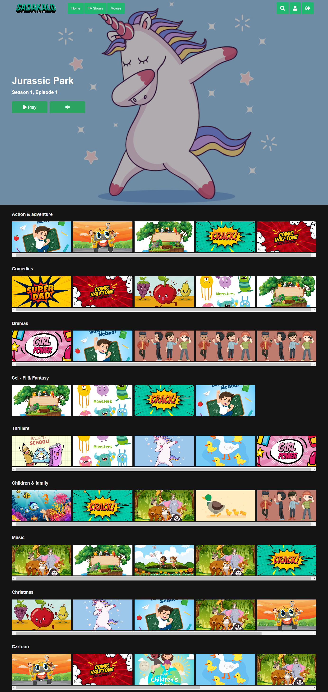
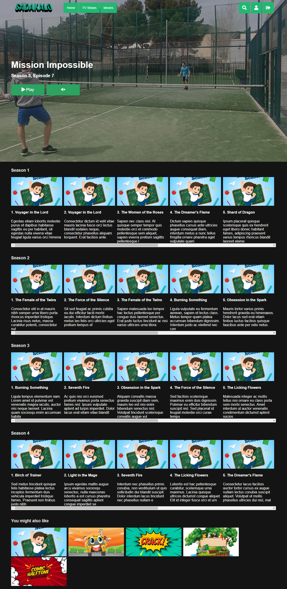

<!--markdown tutorial-->

---

# SadaKalo - OTT Platform

In this project, I have made a movie and series streaming site. Where a user can sign up by providing the required information. After signing up he needs to choose his/her desired package.   After that, he can use his account to watch movies. After logging in, the user can see the home page. On the home page, there will be suggestions for movies and series. He can watch any of them. If the user selects a series, he can also select which season and which episode users wants to see.
Users can also select their desired movie or series under categories.And User can track his number of views and history of watching.

  

